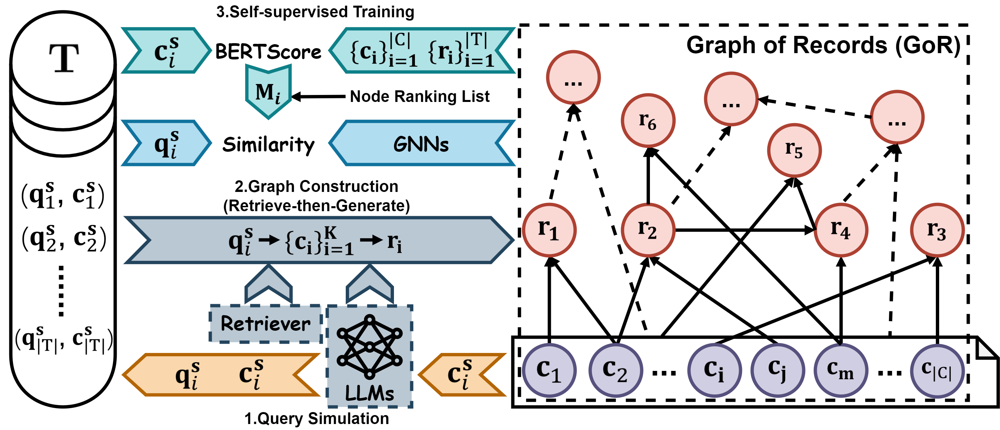

# Graph of Records: Boosting Retrieval Augmented Generation for Long-context Summarization with Graphs


<p align="center">
    <a href="https://ulab-uiuc.github.io/GoR/">
        
    </a>
    <a href="https://arxiv.org/abs/xxx">
        
    </a>
    <!-- <a href="xxx">
        
    </a> -->
    <a href="https://github.com/ulab-uiuc/GoR/blob/master/LICENSE">
        
    </a>
    <br>
    <a href="https://github.com/ulab-uiuc/GoR">
        
    </a>
    <a href="https://github.com/ulab-uiuc/GoR">
        
    </a>
    <a href="https://github.com/ulab-uiuc/GoR">
        
    </a>
</p>


<p align="center">
    <a href="https://ulab-uiuc.github.io/GoR/">🌐 Project Page</a> |
    <a href="https://arxiv.org/abs/xxx">📜 arXiv</a>
    <!-- <a href="xxx">📮 Twitter Post</a> -->
<p>





## News

<!-- **[2024.10.1x]** 🌟Release AcademicEval -->
**[2024.10.1x]** 🌟 GoR is released.
<!-- **[2024.10.1x]** 🌟Release Thought Retriever -->


## 📌Preliminary


### Environment Setup

```bash
# python==3.10
pip install torch==1.12.1+cu113 torchvision==0.13.1+cu113 torchaudio==0.12.1 --extra-index-url https://download.pytorch.org/whl/cu113
pip install dgl==1.0.0+cu113 -f https://data.dgl.ai/wheels/cu113/repo.html
pip install openai==0.28
pip install pandas
pip install langchain
pip install langchain-core
pip install langchain-community
pip install langchain-experimental
pip install tiktoken
pip install tqdm
pip install bert_score
pip install rouge_score
pip install networkx
pip install faiss-gpu
pip install transformers
```

### Dataset Preparation

[QMSum](https://github.com/Yale-LILY/QMSum)
[WCEP](https://huggingface.co/datasets/ccdv/WCEP-10)
[Booksum](https://huggingface.co/datasets/kmfoda/booksum)
[GovReport](https://huggingface.co/datasets/ccdv/govreport-summarization/tree/refs%2Fconvert%2Fparquet/document)
[SQuALITY](https://github.com/nyu-mll/SQuALITY)


Save the downloaded files in the `./data/[DATASET_NAME]` folder.


> \[!IMPORTANT\]
>
> Before running the experiment, please configure your API KEY in `"get_llm_response_via_api"` in `utils.py`


## ⭐Experiments


### Query Simulation and Graph Construction

Generate simulated queries and construct graphs. The constructed graphs are saved in the `./graph` folder.

```bash
# DATASET Choices: qmsum, wcep, booksum, govreport, squality
# Training Set
python graph_construction.py --cuda 0 --dataset [DATASET] --train
# Test Set
python graph_construction.py --cuda 0 --dataset [DATASET]
```


### Training Preparation

Pre-compute BERTScore and save training data in the `./training_data` folder.


```bash
# DATASET Choices: qmsum, wcep, booksum, govreport, squality
python training_preparation.py --cuda 0 --dataset [DATASET]
```


### Training


```bash
# DATASET Choices: qmsum, wcep, booksum, govreport, squality
python train.py --cuda 0 --dataset [DATASET]
```


### Evaluation


```bash
# DATASET Choices: qmsum, wcep, booksum, govreport, squality
# Generate summary results
python eval.py --cuda 0 --dataset [DATASET]
# Evaluation
python sum_eval.py --cuda 0 --file_name ./result/[DATASET].json
```


## Acknowledgments

x


## Citation

```bibtex
@article{GoR,
  title={Graph of Records: Boosting Retrieval Augmented Generation for Long-context Summarization with Graphs},
  author={Haozhen Zhang and Tao Feng and Jiaxuan You*},
  journal={arXiv preprint arXiv:xxx},
  year={2024}
}
```


<!-- <picture>
<source media="(prefers-color-scheme: dark)" srcset="https://api.star-history.com/svg?repos=ulab-uiuc%2FGoR&theme=dark&type=Date">

</picture> -->